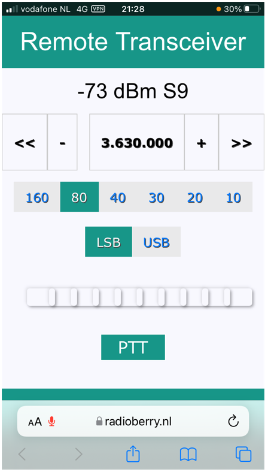

# Radioberry-2.x-Remote

## Frontend

Running in browser. 

## Backend

Running @TOMEE java server.

## Remote

Make use of VPN (no port forwarding).

## Development

Created a maven project
  containing the angular webfront and java backend. 
  
Streams uses websockets and the radio and dsp is controlled using a REST interface.

Using WDSP 1.18 version with Java Native Interface (JNI).

